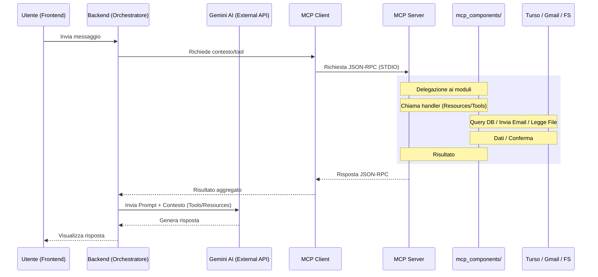

# Model Context Protocol (MCP) Flow Explanation

Questo documento spiega l'architettura MCP implementata in questo progetto e come i componenti comunicano tra loro.

## 🏗️ Architettura Generale

Il Model Context Protocol (MCP) segue un modello Client-Server. In questo progetto, entrambi risiedono nel backend ma hanno ruoli distinti. Il protocollo permette di connettere agenti AI a servizi esterni (**Turso**, **Gmail/Nodemailer**) e risorse locali (**mcp_resources/**).

### Diagramma di Flusso

> [!NOTE]
> Per visualizzare correttamente il diagramma seguente nell'anteprima di VS Code, assicurati di avere installata un'estensione per Mermaid (es. **"Markdown Preview Mermaid Support o Mermaid Viewer"**). Su GitHub il rendering è automatico.

## 📄 Breakdown dei Componenti

### 1. `mcp_server.ts` (Il Server)

- **Ruolo**: Agisce come un "fornitore di risorse", **fornisce** i dati e le funzionalità. In questo caso, scansiona la cartella `mcp_resources/` e rende i file `.md` disponibili all'AI.
- **Meccanica**: Il server è un orchestratore leggero che delega la gestione dei tool e delle risorse alla cartella `mcp_components/`.
  - **`mcp_components/resources.ts`**: Gestisce le risorse markdown nella cartella `mcp_resources/`.
  - **`mcp_components/tools.ts`**: Gestisce le operazioni sulla rubrica (Turso) e i calcoli.
  - **`mcp_components/email.ts`**: Gestisce l'invio delle email tramite Gmail (Nodemailer).
  - Usa `StdioServerTransport`: comunica tramite `stdin` e `stdout` (usiamo `console.error` per i log per non sporcare il canale di comunicazione).

### 2. `mcp_client.ts` (Il Client)

- **Ruolo**: Si connette al server e gli chiede di eseguire operazioni.
- **Meccanica**:
  - È il componente che **consuma** i dati. Si connette al server avviandolo come processo figlio via STDIO (`node --import tsx mcp_server.ts`).
  - Effettua richieste (es. `resources/list`) per ottenere dati dal server.

### 3. `index.ts` (L'Orchestratore)

È il punto di ingresso dell'applicazione. Inizializza il client, gestisce il loop di interazione con l'utente e il passaggio dei tool al modello Gemini.

## 🛰️ Il Protocollo e l'SDK

MCP utilizza **JSON-RPC 2.0** per lo scambio di messaggi. L'SDK di Anthropic (`@modelcontextprotocol/sdk`) fornisce le astrazioni necessarie per gestire i trasporti (STDIO o HTTP/SSE) e la validazione dei messaggi via Zod.

## Documentazione Ufficiale

Per approfondire, ti consiglio di consultare le risorse ufficiali:

- **Sito Ufficiale MCP**: [modelcontextprotocol.io](https://modelcontextprotocol.io/)
- **Repository GitHub SDK (TypeScript)**: [github.com/modelcontextprotocol/typescript-sdk](https://github.com/modelcontextprotocol/typescript-sdk)
- **Esempi di Server**: [github.com/modelcontextprotocol/servers](https://github.com/modelcontextprotocol/servers)
